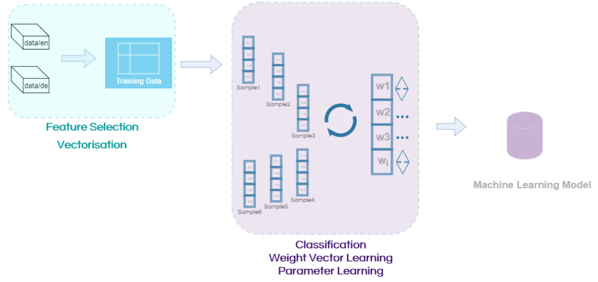

# Machine Learning Foundations 1

This summary covers all the theoretical parts of the bfh lecture "Machine Learning Foundations 1".

# Table of contents
- [Machine Learning Foundations 1](#machine-learning-foundations-1)
- [Table of contents](#table-of-contents)
  - [1. Machine learning \& data engineering context](#1-machine-learning--data-engineering-context)
    - [1.1 Drivers of data engineering development](#11-drivers-of-data-engineering-development)
      - [Where do we stand in the hype cycle regarding Artificial Intelligence and Machine Learning? (Perez Technological Surge Cycle)](#where-do-we-stand-in-the-hype-cycle-regarding-artificial-intelligence-and-machine-learning-perez-technological-surge-cycle)
      - [What are main drivers of the current hype around machine learning and data engineering?](#what-are-main-drivers-of-the-current-hype-around-machine-learning-and-data-engineering)
    - [1.2 Data Centric business models](#12-data-centric-business-models)
      - [What are some existing data centric business applications?](#what-are-some-existing-data-centric-business-applications)
      - [How can data function as a moat? (definition of "moat")](#how-can-data-function-as-a-moat-definition-of-moat)
      - [What are the advantages and disadvantages of the approach?](#what-are-the-advantages-and-disadvantages-of-the-approach)
  - [2. Introduction to machine learning](#2-introduction-to-machine-learning)
    - [2.1 Machine Learning Fundamentals](#21-machine-learning-fundamentals)
      - [Definitions ML and AI](#definitions-ml-and-ai)
      - [ML - an entirely different kind of coding](#ml---an-entirely-different-kind-of-coding)
      - [What are the main ways of machine learning?](#what-are-the-main-ways-of-machine-learning)
      - [What are disadvantages of supervised machine learning?](#what-are-disadvantages-of-supervised-machine-learning)
      - [What are advantages of unsupervised machine learning?](#what-are-advantages-of-unsupervised-machine-learning)
    - [2.2 Machine learning workflow](#22-machine-learning-workflow)
      - [What are the steps of the machine learning workflow?](#what-are-the-steps-of-the-machine-learning-workflow)
      - [What are features?](#what-are-features)
      - [What is feature engineering?](#what-is-feature-engineering)
      - [What is classification?](#what-is-classification)
    - [2.3 Performance measurement](#23-performance-measurement)
      - [What is precision?](#what-is-precision)
      - [How is precision calculated?](#how-is-precision-calculated)
      - [How is recall calculated?](#how-is-recall-calculated)
      - [How can a confusion matrix be utilized?](#how-can-a-confusion-matrix-be-utilized)
    - [2.4 Test collection curation](#24-test-collection-curation)
      - [What are main dependencies for the curation of test collection?](#what-are-main-dependencies-for-the-curation-of-test-collection)
      - [What are best practices for the definition of test collections?](#what-are-best-practices-for-the-definition-of-test-collections)
      - [What are common mistakes that can be made when creating a test collection?](#what-are-common-mistakes-that-can-be-made-when-creating-a-test-collection)
    - [2.5 Annotation](#25-annotation)
      - [What must be taken into consideration when planning for annotation in a project with machine learning?](#what-must-be-taken-into-consideration-when-planning-for-annotation-in-a-project-with-machine-learning)
      - [What are best practices for annotation?](#what-are-best-practices-for-annotation)
      - [Give an example for instructions that could be provided to the assessors?](#give-an-example-for-instructions-that-could-be-provided-to-the-assessors)
      - [What is a metric that can be used to measure the quality of an annotation process?](#what-is-a-metric-that-can-be-used-to-measure-the-quality-of-an-annotation-process)
      - [What insights can be drawn from a low inter-annotator agreement?](#what-insights-can-be-drawn-from-a-low-inter-annotator-agreement)
    - [2.6 Vectorization](#26-vectorization)
      - [What is vectorization?](#what-is-vectorization)
      - [When is vectorization trivial?](#when-is-vectorization-trivial)
      - [What are possible approaches for the vectorization of non-numeric features?](#what-are-possible-approaches-for-the-vectorization-of-non-numeric-features)
      - [Insight into the impact of vectorization on the overall machine learning process.](#insight-into-the-impact-of-vectorization-on-the-overall-machine-learning-process)
  - [3. Gears of machine learning](#3-gears-of-machine-learning)
    - [Area 1: Dataset composition, feature engineering, pre-processing, vectorization.](#area-1-dataset-composition-feature-engineering-pre-processing-vectorization)
    - [Area 2: ML Algorithm, Training Configuration, Training Time](#area-2-ml-algorithm-training-configuration-training-time)
    - [Area 3: Test-Data Design, Metrics Choice, Evaluation](#area-3-test-data-design-metrics-choice-evaluation)
    - [What are the three main areas to influence the outcome of machine learning?](#what-are-the-three-main-areas-to-influence-the-outcome-of-machine-learning)
    - [What is a baseline?](#what-is-a-baseline)
    - [What needs to be documented to be able to reproduce a baseline?](#what-needs-to-be-documented-to-be-able-to-reproduce-a-baseline)
    - [Why is it important to document the setup of a machine learning run?](#why-is-it-important-to-document-the-setup-of-a-machine-learning-run)
    - [What are steps that can be taken to optimize the training material?](#what-are-steps-that-can-be-taken-to-optimize-the-training-material)
    - [What are steps that can be taken to optimize the evaluation?](#what-are-steps-that-can-be-taken-to-optimize-the-evaluation)
  - [3. Training Exam](#3-training-exam)
    - [Exercise 1](#exercise-1)
      - [Question 1. Based on the measurements shown in the confusion matrix, what is your interpretation of the machine learning model performance?](#question-1-based-on-the-measurements-shown-in-the-confusion-matrix-what-is-your-interpretation-of-the-machine-learning-model-performance)
      - [Solution](#solution)

## 1. Machine learning & data engineering context

### 1.1 Drivers of data engineering development

Smart application development is driven by
- Data availability
- Encompassing public data
- Web sources
- APIs
- REST services
- In-house data
- Further influenced by digitalization and Industry 4.0 trends

#### Where do we stand in the hype cycle regarding Artificial Intelligence and Machine Learning? (Perez Technological Surge Cycle)


5 Phases:

1. **Irruption Phase**: AI and ML emerge with advancements in deep learning and neural networks.
2. **Frenzy Phase**: High excitement and investment in AI and ML across sectors like healthcare and finance.
3. **Synergy Phase**: AI and ML are integrated into various industries for practical applications.
4. **Maturity Phase**: AI and ML are evolving towards becoming standard in business, but not yet widespread.
5. **Recapitulation Phase**: AI and ML undergo cycles of challenges and adaptations, addressing issues like ethics and regulation.

As of January 2024 we are in phase **3 Synergy**: Technologies mature and companies find practical applications where they are being integrated into operations.

#### What are main drivers of the current hype around machine learning and data engineering?

- **Technological advancements**: Continuous improvements behind the tech of ML and AI --> better hardware and algorithms, specialized tools that allow ML solutions to be implemented easier.
- **Big Data**: Enormous amount of data that can be used for varying tasks, especially in the context of data engineering
- **Advancements in ML**: Rise of powerful algorithms (deep learning, large language models and natural language processing)

Data availability, abundance of connected computing and installation artifacts (algorithms, software, skilled people) are factors that drive towards rise of smart data-driven applications

### 1.2 Data Centric business models

#### What are some existing data centric business applications?

- **Data Processing**: OracleDB, MongoDB, ... etc.
- **Data Enhancement(AI, ML)**: DeepL, Google Cloud AI, Microsoft Cognitive Services

#### How can data function as a moat? (definition of "moat")

A business "moat" is a unique, sustainable competitive advantage, with data being a key way to establish it.

**Reviews as a moat**:

Encouraging customer reviews helps companies build a competitive advantage by creating a large dataset useful for market analysis, product enhancement, and attracting new customers. Examples:
- Amazon Reviews
- Eat.ch reviews
- Encouragement to leave reviews

**Collection of data as a moat**:
- Google maps, efforts to have you work for them: local guide, gamification (improves map accuracy)
- Captchas, for ex: former google captchas (book projects, street view house numbers)

**Training data for ML as a moat**:
- Tesla autopilot data collection, the more data that gets collected, the better the algorithm becomes
- Common voice project

#### What are the advantages and disadvantages of the approach?

| **Advantages**        | **Disadvantages**          |
| --------------------- | -------------------------- |
| Competitive advantage | Data security risks        |
| Innovation            | Costs of data management   |
| Customer loyalty      | Problems with data quality |

**Advantages:**
1. **Competitive Advantage**: A data-centric strategy offers a significant edge by enabling better products, services, and customer experiences based on data-driven insights.
2. **Innovation**: Data can drive innovation by allowing the development of new features, products, and services that more effectively meet customer needs and preferences.
3. **Customer Loyalty**: Personalized experiences and recommendations based on data can increase customer loyalty and reduce churn.

**Disadvantages:**
1. **Data Security Risks**: Managing and protecting data can be challenging, with data breaches and security vulnerabilities potentially leading to significant financial and reputational damage.
2. **Data Management Costs**: Building and maintaining data infrastructures, including storage, processing, and security measures, can be expensive.
3. **Data Quality Issues**: Poor data quality or inaccurate data can lead to incorrect insights and flawed business decisions.

## 2. Introduction to machine learning

### 2.1 Machine Learning Fundamentals

#### Definitions ML and AI

- **Machine Learning (ML)**: An umbrella term for computer-based learning techniques applied to problem-solving, including deep learning and regression.
- **Artificial Intelligence (AI)**: Often a marketing term today, where "AI" and "Deep Learning" (DL) are frequently used interchangeably. Originally, it referred to computational modeling of human reasoning, with initial approaches being symbolic and rule-based.

#### ML - an entirely different kind of coding


#### What are the main ways of machine learning?

**Supervised learning**:

Learn based on defined examples. Trains on a labeled dataset, each data point has a corresponding target or outcome. Model learns to map input data to correct output based on labels.

*Applications*: Classification (spam detection, image recognition), regression (predicting house prices, stock prices)

**Unsupervised learning**:

Learn based on observing data. Trains on unlabeled data. Model tries to discover patterns, structures or groupings within the data without guidance.

*Applications*: Clustering (customer segmentation), dimensionality reduction (principal component analysis), generative modeling

#### What are disadvantages of supervised machine learning?

Requires human assessment, generally large number of samples. Data needs to be labeled, is also dependent on quality of labels. Imbalanced datasets lead to biased models.

#### What are advantages of unsupervised machine learning?

Reduced labeling effort and cost saving (data does not need to be manually labeled) --> lower initial effort.

### 2.2 Machine learning workflow

#### What are the steps of the machine learning workflow?


1. **Prepare Training Material**: Collect, clean, and preprocess data.
2. **Provide Training Material**: Distribute data on machines, splitting into Test, Dev, and Train sets.
3. **Train ML Model**: Set initial hyperparameters, conduct initial training, and verify setup correctness.
4. **Evaluate and Analyze**: Perform quantitative and qualitative evaluations, then analyze results.
5. **Optimize and Adjust**: Adjust hyperparameters based on Step 4 results and conduct additional training runs.

#### What are features?

The individual data sources, the individual properties that describe the
input objects.


#### What is feature engineering?

Real-world machine learning requires the creation of training data sets. A first step
towards this is often the creation of a set of features. This is called Feature Engineering: The collection and pre-processing of material to enhance the training material and the resulting trained models.

#### What is classification?

Classification in data analysis involves sorting data points into predefined categories, such as categorizing emails as "spam" or "no spam," based on their characteristics. This automated process helps computers recognize patterns and make decisions.

### 2.3 Performance measurement


#### What is precision?

Indication of model accuracy, measured by the fraction of correct decisions. Can be misleading, especially with imbalanced datasets, as it may not reflect consistent errors in certain classes.

#### How is precision calculated?

- **True Positives (TP)**: Correct predictions.
- **True Negatives (TN)**: Correct false predictions.
- **False Positives (FP)**: Incorrectly identified as positive.
- **False Negatives (FN)**: Incorrectly missed as positive.

To calculate precision: $\frac{TP}{TP + FP}$

#### How is recall calculated?

Fraction of correctly detected relevant items: $\frac{TP}{TP + FN}$, where $TP + FN$ are the **relevant elements**

#### How can a confusion matrix be utilized?

Also known as truth matrix. Can be used to assess quality of classification model in ML.


- **Accuracy**: Proportion of true results (both true positives and true negatives) in the test set: $\frac{TP + TN}{TP + FP + TN + FN}$
- **Precision**: Proportion of true positive predictions in all positive predictions made: $\frac{TP}{TP + FP}$
- **Recall**: Proportion of true positives in all actual positives: $\frac{TP}{TP + FN}$
- **F1-Score**: Harmonic mean of precision and recall, balancing the two metrics: $\frac{2*Precision*Recall}{Precision + Recall}$
- **Specificity**: Proportion of true negatives in all actual negatives: $\frac{TN}{FP + TN}$

### 2.4 Test collection curation

#### What are main dependencies for the curation of test collection?

- Availability of Data (Are there legal restrictions that limit access to the available data)
- How hard is it to get the actual data
- Data privacy issues

#### What are best practices for the definition of test collections?

- **Realism in Terms of Expected Data**: Ensure test collections for systems like email classifiers reflect the actual types of emails the system will process.
- **Match Expectations**: Training data must mirror the real-world data a smart application or service will encounter to be effective.
- **Relevant Training**: Avoid using non-representative data (e.g., customer complaints for a technical support classifier) as it won't be helpful.
- **Bias Reduction**: Account for historical data trends and diversify sources to prevent bias—avoid using data exclusively from one department, group of workers, news source, or customer. Apply strategies to avoid bias

#### What are common mistakes that can be made when creating a test collection?

- **Common Test Collection Mistakes**:
  - **Insufficient Data Size**: Not enough samples per class (minimum 10-50).
  - **Non-Representative Data**: Data that doesn't reflect the use case.
  - **Incorrect Labels**: Mislabelled data leading to inaccurate training.
  - **Sampling Bias**: Non-random or unfair sampling methods.
  - **Imbalanced Classes**: Uneven distribution of classes in the dataset.

- **Constraints in Defining a Test Collection**:
  - **ML Task Type**: Determines the nature of the test data needed.
  - **Data Availability**: Influenced by access restrictions and the effort required to collect data.

- **Best Practices**:
  - **Structured Sampling**: Choose a sample that fits the task, anticipated future use, and domain.
  - **Bias Awareness**: Recognize potential biases and implement strategies to mitigate them.

### 2.5 Annotation

Annotation (a.k.a. Assessment, Rating, Labelling) is the process of labeling data for use in supervised machine learning. Although unsupervised learning starts with unlabeled data, labeled data is eventually needed for evaluation.

#### What must be taken into consideration when planning for annotation in a project with machine learning?

- **Crucial Questions for Assessment Data**:
  - **Existence of Compatible Data**: Check for already assessed data that fits the ML task, domain, and use case.
  - **Effort for Data Creation**: If no compatible data exists, estimate the time required to create and annotate data. This depends on task complexity (assessing legal case classification can take several hours per sample, while binary classification of text messages might take only seconds per sample)
  - **Assessor Availability**: Determine who can annotate the data, considering if specific expertise, like legal or marketing knowledge, is necessary.

- **Annotation Planning**:
  - **Need for Additional Annotations**: Anticipate potential updates or expansions to the annotation scheme.
  - **Project Impact**: Understand that the availability of annotated data is critical and can delay ML project development if not adequately planned.

#### What are best practices for annotation?

Reserving time for annotation is important.

- **Most important**: clear documentation of instructions for assessors.
- Prefer binary assessments over scaled assessments (e.g. how relevant is this e-mail on a scale from 1-10)
- Prefer binary classification to multinomial (2+) classification
- Apply annotation as a sanity check for the task
  - The level of agreement between the human assessors is called **interannotator agreement (IAA)** or inter- rater agreement.
  - E.g if the interannotator agreement is 70%, the machine learning will not outperform this value in terms of precision.
- Inter-annotator agreement & Upper bound
  - Calculating Inter-annotator agreement can be used as early sanity check
    - How realistic is a task? If humans cannot agree on a label, how can we expect a machine to do it?
    - Identifying mistakes in assessment setup
- Appropriate annotators

#### Give an example for instructions that could be provided to the assessors?

[Example definition](http://www.promise-noe.eu/documents/10156/ed72d59a-5915-42b3-bf6c-c5b41e8cc58b) of instructions for assessments:
```
<top>
<head> Tipster Topic Description
<num> Number: 104
<dom> Domain: Law and Government
<title> Topic: Catastrophic Health Insurance
<desc> Description:
Document will enumerate provisions of the U.S. Catastrophic Health Insurance Act of 1988, or the political/legal fallout from that legislation.
<narr> Narrative:
A relevant document will detail the content of the U.S. Medicare act of 1988 which extended catastrophic illness benefits to the elderly., with particular attention to the...
...continued
```

#### What is a metric that can be used to measure the quality of an annotation process?

Calculating the Inter-annotator agreement. There also advanced measures:
- **Kendells Tau** (2 Annotators)
- **Kendells W** (2+ Annotators)
- **Fleiss** (2+ Annotators),
- **Kappa**

#### What insights can be drawn from a low inter-annotator agreement?

The inter-annotator agreement defines roughly an upper limit (upper bound) for the performance that can be expected from a machine learning system.
- **Unclear Guidelines**: Low IAA could indicate that annotation instructions are ambiguous.
- **Inadequate Training**: It may reflect that annotators lack proper training or familiarity with the task.
- **Data Quality Issues**: Inconsistencies or errors in the data could lead to low IAA.

### 2.6 Vectorization

#### What is vectorization?

The process involves converting data originally in various forms or formats (like text, images, or other data) into vectors. In data processing and machine learning, vectorization is often used to structure data in a form more easily understood and analyzed by algorithms. For example, words in texts can be converted into vectors for text analysis algorithms.

- **Data Conversion**: Transforming different data forms (text, images, etc.) into vectors.
- **Structured Format**: Vectorization structures data for better algorithmic understanding and analysis.
- **Application in ML**: Used for applying algorithms, such as converting text to vectors for text analysis.

#### When is vectorization trivial?

Vectorization is deemed trivial when data or operations are inherently suited for vectorized operations, requiring minimal complex transformations or computations:
- **Numeric Arrays**: Straightforward vectorization with element-wise operations on lists of numbers or matrices.
- **Image Processing**: Natural fit for vectorization due to images being structured as 2D pixel grids, facilitating operations like resizing and blurring.
- **Time Series Data**: Easily vectorized for operations such as smoothing, filtering, or aggregating over time intervals.

#### What are possible approaches for the vectorization of non-numeric features?

- **Vectorization of Non-Numeric Data**: Crucial for incorporating text or categorical data into numerical-based ML models.
- **Count Vectorization for Text**: Converts text documents into numerical vectors by word frequency.
- **Unique Word Dimensions**: Each word in the corpus gets a dimension, and the vector reflects word count in the document.
- **Bag-of-Words (BoW) Application**: Suitable for BoW techniques, representing text data as a collection of word counts.

#### Insight into the impact of vectorization on the overall machine learning process.

- **Efficiency in Python**: Vectorization eliminates for-loops, speeding up code execution.
- **Crucial for Deep Learning**: Essential for handling large datasets, enabling faster algorithm training.
- **Transforming Data**: Converts non-numeric data like text or categorical features into a numerical format.
- **Model Compatibility**: Ensures data can be effectively processed by most machine learning algorithms.

## 3. Gears of machine learning

### Area 1: Dataset composition, feature engineering, pre-processing, vectorization.


### Area 2: ML Algorithm, Training Configuration, Training Time


### Area 3: Test-Data Design, Metrics Choice, Evaluation


### What are the three main areas to influence the outcome of machine learning?

1. **Training Set**

   a. **Selection of Training Material**: Choosing appropriate data for training.

   b. **Pre-processing of Training Material**: Cleaning and preparing the data.

   c. **Feature Engineering**: Creating and selecting relevant features from data.

2. **ML Algorithm**
   
   a. **Choice of Algorithm**: Deciding on the most suitable machine learning algorithm.

   b. **Tuning of Algorithm**: Adjusting hyperparameters for optimal performance.

3. **Evaluation**
   
   a. **Improve Validity**: Ensuring the evaluation measures are accurate.
   
   b. **Improve Granularity**: Considering more detailed or fine-grained measurements.

### What is a baseline?

To be sure that we are indeed improving things it is important to take stock of where we stand.
To do this we define an observed performance as our baseline. Baseline just means that we define a measurement as a value for future comparison. Usually, one wants to make sure to record the circumstances of what was used for creating the baseline.

### What needs to be documented to be able to reproduce a baseline?
- Training Data
- Algorithm Choice
- Algorithm Configuration (Hyperparameters)

Executing with the above combination is often called a Run.

### Why is it important to document the setup of a machine learning run?

- **Baseline Purpose**: Serves as a reference point for optimization in machine learning.
- **Consistency and Efficiency**: Ensures repeatability and conserves the efforts of data and ML engineers.
- **Concern in ML Projects**: Lack of transparency in training data and model creation in many deployed projects, leading to uncertainty.

### What are steps that can be taken to optimize the training material?

- Increase training set size
- Improve pre-processing (Clean-up of the data)
- Feature Engineering (Change the defined features)

### What are steps that can be taken to optimize the evaluation?
- Ensure the assessments are correct (calculate inter-annotator agreement)
- Increase test data size
- Increase testing (Test multiple times)
- Test with different splits across test and train

## 3. Training Exam

### Exercise 1

You train a machine learning model to classify customer e-mails. There are two classes (COMPLAINT, QUESTION).

After training the model you test its performance on a test set with 10000 samples and observe the results presented in the following confusion matrix:


The end-users of the solution are very focused on identifying COMPLAINTS.

The reasoning behind this is, that those e-mails should be handled with higher priority, as it provides an efficient way to increase customer satisfaction.

#### Question 1. Based on the measurements shown in the confusion matrix, what is your interpretation of the machine learning model performance?

Based on the measurements shown in the confusion matrix, here's the interpretation
of the machine learning model performance:

|                      | 0 - COMPLAINT | 1 - QUESTION |
| -------------------- | ------------- | ------------ |
| True Positives (TP)  | 500           | 7000         |
| True Negatives (TN)  | 7000          | 500          |
| False Positives (FP) | 1000          | 1500         |
| False Negatives (FN) | 1500          | 1000         |

Now, let's calculate key performance metrics:

Accuracy: $\frac{TP + TN}{TOTAL}=\frac{7000 + 500}{10'000}=75\%$

Precision (for Class 0 - COMPLAINT): $\frac{TP}{TP+FP}=\frac{500}{500+1000}≈33.33\%$

Recall (for Class 0 - COMPLAINT): $\frac{TP}{TP+FN}=\frac{500}{500+1500}=25\%$

The model has a precision of only 33.333% = 500 / (500 + 1000), with a recall of 25% = 500 / (500 + 1500). Based on this observation we can say the model is very inaccurate.

#### Solution
Here is a sample answer:

The confusion matrix shows us, that there is considerable confusion for both classes. 2500 samples have been falsely classified overall. The model performance is not suitable for the use case. 1000 E-mails of class COMPLAINT are classified as QUESTION, and 1500 QUESTION E-Mails have been classified as COMPLAINT. The use case is focused on treating COMPLAINT E-Mails with higher priority. It is therefore very problematic that 1000 COMPLAINT e-mails are classified as class QUESTION and might not be treated with high priority. 

Analysis of Answer:

Here is the original question: 

Q1: Based on the measurements shown in the confusion matrix, what is your interpretation of the machine learning model performance?
Q2: Does it fit with the customer expectations (Yes/No) ? Provide a short explanation for your choice that refers to the measurements in the confusion matrix.
The most important aspect is that you read the question carefully and answer only the bits that are requested. 

Based on the measurements shown in the confusion matrix, what is your interpretation of the machine learning model performance?
Here you can answer as shown above:

The confusion matrix shows us, that there is considerable confusion for both classes. 2500 samples have been falsely classified overall. (2p)

Alternatively describe the behavior using precision, or percentage of false positives. E.g. :

The precision of the model is 0.75 (2500 E-Mails wrongly classified, not on diagonal of matrix)
There are 2500 False Positives and 7500 True Positives
25 % of the E-Mails in the Test set are False Positives.
25% of the E-Mails in the Test set are False Positives. 
If you would only provide a general statement about the performance and not refer to the values in the matrix you would loose points. All above variants are complete points variants.

Does it fit with the customer expectations (Yes/No) ? Provide a short explanation for your choice that refers to the measurements in the confusion matrix.
Here it is important to give a clear yes / no indication and to refer to the measurements in the matrix:

The model performance is not suitable for the use case. 1000 E-mails of class COMPLAINT are classified as QUESTION, and 1500 QUESTION E-Mails have been classified as COMPLAINT. The use case is focused on treating COMPLAINT E-Mails with higher priority. It is therefore very problematic that 1000 COMPLAINT e-mails are classified as class QUESTION and might not be treated with high priority. 

The important bit here is to show that you can read the confusion matrix and understand the confusion of the model and how it relates to the use cases.  In above answer there is:

A clear answer that the model performance does not fit the use case (2p)
The answer is based on referencing and arguing based on the confusion matrix (2p)
It explains what the problematic aspect is for the use case (2p)
Please note that while the misclassified COMPLAINT e-mails are the worst aspect for the use case you could have also argued on the misclassified QUESTION e-mails that create additional work-load and potential delays for the team working on customer complaints, and would have also gotten full points. 

**Question 2**:

Does it fit with the customer expectations (Yes/No) ? Provide a short explanation for your choice that refers to the measurements in the confusion matrix.
